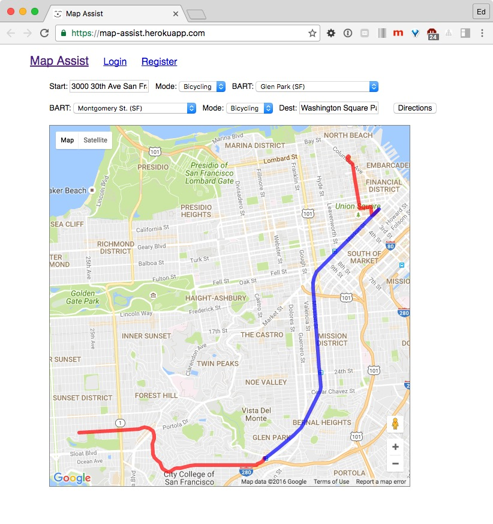

# Map Assist

[Google Maps](http://maps.google.com) is great - you can get directions for Driving or Bicycling or Walking or Transit.

But....    you can't mix & match!   (well, except for walking + transit). If you want to map a trip via Bicycle + [BART](http://www.bart.gov) + Bicycle - sorry, you'll need to call up directions on **three separate** Google Maps! 🤔

This is where **Map Assist** comes in.

Map Assist lets you enter a starting & ending destination, two BART stations, and the mode of travel between them (i.e. walking, bicycling or driving), and will display all 3 legs of your journey on **one map**, simultaneously. [Version 1](https://github.com/edmechem/mapassist/tree/master#readme) is hosted on [Heroku](https://map-assist.herokuapp.com), and has this basic functionality:

The in-progress version on the [development branch](https://github.com/edmechem/mapassist/tree/development#readme) will have the following additional features:

- Location input via a Google Places field, with autocomplete drop-down.
- Favorites: Saved locations, legs & trips
- Aggregate time calculation for entire trip
- Nicer style & more responsive mobile-friendly design